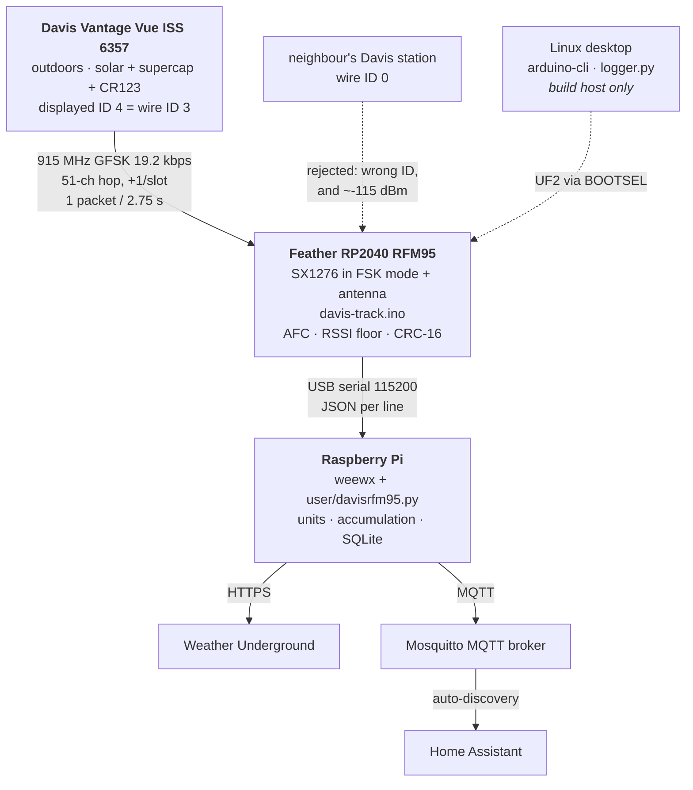

# Receiving a Davis Vantage Vue with an Adafruit Feather RP2040 RFM95

Decoding a **Davis Vantage Vue ISS (model 6357)** weather station directly with an
**Adafruit Feather RP2040 RFM95**, with no Davis console involved.

The end result follows the station's frequency-hopping schedule and captures
**every transmission — one packet every 2.75 seconds**, giving a complete sweep of
all sensor types in about 51 seconds.

```
ch=45 rssi=-72 type=0x2 batt=OK wind=0mph@100 supercapRaw=77
ch=46 rssi=-73 type=0xE batt=OK wind=0mph@100 rainCount=128
ch=47 rssi=-72 type=0x5 batt=OK wind=0mph@100 rainRateRaw=255
ch=48 rssi=-75 type=0x8 batt=OK wind=0mph@100 temp=69.1F
ch=49 rssi=-71 type=0x7 batt=OK wind=0mph@100
ch=50 rssi=-70 type=0xE batt=OK wind=0mph@100 rainCount=128
ch=0  rssi=-70 type=0x5 batt=OK wind=0mph@100 rainRateRaw=255   <- clean wrap 50->0
```

This repo documents the working receiver **and** the investigation that produced it,
including the wrong turns — several of the dead ends are more instructive than the
final code, and the diagnostic sketches are kept so the measurements are repeatable.

---

## System



The neighbour's station is shown because it is a real participant in the RF
environment, not a curiosity: it transmits on the same default ID the Vue ships
with, and mistaking it for the local station sent this project down a long dead
end. The transmitter-ID filter and `RSSI_FLOOR` exist to exclude it.

The desktop is a build host only and drops out once the Pi is running.

---

## Hardware

| Item | Notes |
|---|---|
| Davis Vantage Vue ISS 6357 | Solar panel + supercapacitor, CR123 lithium backup. No on/off switch — pulling the battery tab powers it up. It will keep running on the supercap alone in daylight. |
| Adafruit Feather RP2040 RFM95 | RP2040 + SX1276 radio. **An antenna is required.** |

Board pinout (fixed on-board):

| Signal | GPIO |
|---|---|
| RFM95 CS | 16 |
| RFM95 RST | 17 |
| RFM95 DIO0 (IRQ) | 21 |
| RFM95 DIO1 | 22 |
| SPI | SCK 14, MOSI 15, MISO 8 (SPI1, already the default `SPI` object for this board) |

The RFM95 is **not** used in LoRa mode. Davis uses plain GFSK, and the SX1276
supports raw FSK/GFSK alongside LoRa — this project uses the FSK modem.

---

## Protocol facts (all measured on this hardware)

| Property | Value |
|---|---|
| Band | 902–928 MHz (US), 51 channels |
| Modulation | GFSK, BT = 0.5 |
| Bit rate | 19.2 kbps |
| Frequency deviation | ~5 kHz |
| RX bandwidth | 25 kHz, **AFC on** with 50 kHz AFC bandwidth |
| Sync word | `0xCB 0x89` (2 bytes) |
| Preamble | 4 bytes |
| Packet | 10 bytes, fixed length, radio CRC **off** (Davis uses its own) |
| Bit order | LSB-first — every received byte must be bit-reversed |
| CRC | CRC-16-CCITT (poly `0x1021`, init 0) over bytes 0–5, compared to bytes 6–7 |
| Slot interval | `(41 + wireID) / 16` seconds |
| Cycle | 51 slots, one channel per slot, stepping **+1** through the channel table |

### Transmitter ID

The ISS displays IDs **1–8**; the packet carries **0–7**. Displayed ID = wire ID + 1.
This was confirmed by measurement, not assumed: setting the station to displayed ID 4
produced packets with `id=3`, and the inter-packet gaps became exact multiples of
2750 ms = `(41 + 3)/16` s — an interval only that ID produces.

| Displayed ID | Wire ID | Slot interval |
|---|---|---|
| 1 | 0 | 2562.5 ms |
| 4 | 3 | 2750 ms |

### Packet layout

| Byte | Meaning |
|---|---|
| 0 | high nibble = sensor type; bit 3 = battery low; bits 0–2 = transmitter ID |
| 1 | wind speed (mph) |
| 2 | wind direction (1–360 encoded in one byte; 0 = north or vane fault) |
| 3–5 | sensor-specific payload |
| 6–7 | CRC-16-CCITT |
| 8–9 | repeater data (`0xFF` when no repeater) |

| Type | Sensor | Decode |
|---|---|---|
| `0x8` | Temperature | `(b3 * 256 + b4) / 160` °F |
| `0xA` | Humidity | `(((b4 >> 4) << 8) + b3) / 10` % |
| `0x4` | UV index | `(((b3 << 8) + b4) >> 6) / 50` |
| `0x6` | Solar radiation | `(((b3 << 8) + b4) >> 6) * 1.757936` W/m² |
| `0xE` | Rain | `b3` = cumulative bucket-tip counter (mod 256) |
| `0x5` | Rain rate | raw `b3` — scaling not verified here |
| `0x9` | Wind gust | raw `b3` — scaling not verified here |
| `0x2` | Supercap voltage | raw `b3` |

Types `0x3` and `0x7` were observed but are not documented in the reference material
and are not decoded.

### Channel table

The 51 US channel frequencies are derived from the
[DavisRFM69](https://github.com/dekay/DavisRFM69) project's `FRF` register table,
converted with the standard SX12xx synthesizer step `Fstep = 32 MHz / 2^19`. The
transcription was verified programmatically against the upstream header — 51 entries,
exact values, exact order. Minimum spacing between channels is 500.9 kHz.

---

## The receiver

[`firmware/davis-track.ino`](firmware/davis-track.ino)

How it works:

1. Park on a known channel until a **strong** packet arrives — that anchors both the
   slot clock and our position in the hop sequence.
2. Thereafter advance exactly one channel per 2750 ms slot, whether or not a packet
   was heard, so the schedule stays aligned through dropouts.
3. Re-time on every strong packet to absorb clock drift.
4. After `MAX_MISSES` consecutive empty slots, drop back to parking and re-acquire.

Because the station steps +1 per slot, absolute slot numbering is unnecessary:
hearing it on channel *c* means the next transmission is on *c+1*.

### ⚠️ `RSSI_FLOOR` must be changed when the station is mounted outdoors

`RSSI_FLOOR` (default **−120 dBm**, i.e. effectively off) exists because a transmitter sitting ~30 cm from the
receiver **bleeds through the front end on channels it is not using**, producing packets
that decode perfectly but are ~40 dB down. Anchoring the schedule on those corrupts it.

That bleed only happens at very close range. As the station moves further away the real
signal weakens, and the floor starts **rejecting genuine packets** instead.

This is not hypothetical — it was observed. With the floor at −95 dBm and the signal at
−81 to −95 dBm, capture fell to ~36% (one packet per 7.6 s) while the "bleed" counter
grew to nearly double the good count, because those discarded packets were real.
Lowering the floor to −105 dBm restored **100% capture, 43 of 43 consecutive slots**.

So: the floor must be re-tuned whenever the station moves. Measured reference points:

| Station position | Real signal | Capture at −105 floor |
|---|---|---|
| ~30 cm (desk) | −64 to −80 dBm | 100% |
| moved further | −81 to −99 dBm | ~36% (floor cutting in) |
| moved again | −103 to −117 dBm | 0% — looked like total failure |

At the last position almost every real packet is below −105, so the floor is now set to
−120 (effectively off), restoring ~90% capture.

Note the floor has stopped being useful as a discriminator: near-field bleed measured
−107 to −121 dBm, which now **overlaps** the real signal, so no threshold could separate
them. That is fine, because bleed is a near-field effect and disappears at distance — but
it means the floor is only worth raising again if the station is very close.

At −103 to −117 dBm the link is near the SX1276's sensitivity limit for this
configuration (roughly −110 to −118 dBm), which accounts for the ~10% loss. Recovering
that is an antenna/placement question, not a software one.

---

## Build and flash

Requires the [arduino-pico](https://github.com/earlephilhower/arduino-pico) core and
[RadioLib](https://github.com/jgromes/RadioLib) (tested with 7.7.1).

```bash
arduino-cli core install rp2040:rp2040
arduino-cli lib install RadioLib
arduino-cli compile --fqbn rp2040:rp2040:adafruit_feather_rfm --output-dir ./build firmware/
```

The board definition `adafruit_feather_rfm` covers both the RFM69 and RFM95 variants —
same PCB, different radio.

Flashing: hold **BOOTSEL**, tap **RESET**, release. The board mounts as `RPI-RP2`:

```bash
cp build/*.uf2 "/run/media/$USER/RPI-RP2/"
```

`arduino-cli upload` alone does not work here — the sketch does not implement the
1200-baud touch-reset, so the manual BOOTSEL step is always required.

Reading output (115200 baud). `arduino-cli monitor` produced nothing when run
non-interactively; [`tools/logger.py`](tools/logger.py) is more reliable:

```bash
sudo python3 tools/logger.py out.log
```

Serial access needs group membership (`uucp` on Arch, `dialout` on Debian/Ubuntu):

```bash
sudo usermod -aG uucp "$USER"   # takes effect next login
```

---

## The investigation

Six distinct problems, only one of which was the protocol. Recorded because each was
non-obvious and cost real time.

### 1. Wrong RadioLib chip class → `-12 RADIOLIB_ERR_INVALID_FREQUENCY`

The first firmware used RadioLib's `SX1278` class, which only accepts 137–175 MHz and
395–525 MHz. It rejected 915 MHz outright and the radio never initialised. The RFM95
needs the **`SX1276`** class (137–175, 395–525, **862–1020 MHz**).

This failed *silently* at first, because the error path printed once and then sat in a
bare `while(true){}`. Every subsequent print in the loop was unreachable, so the board
looked dead. **Lesson: make error paths repeat, not latch.** Adding a heartbeat is what
finally exposed the `-12`.

### 2. Blocking receive left the radio deaf

The first design called `radio.receive(buf, len, timeout)` in a loop, and in tracking
mode `delay()`-ed until the expected arrival. But RadioLib leaves the radio in standby
between calls, and the packet is only ~7 ms long — any window spent not listening is a
packet lost.

The reference implementation instead keeps the radio in **continuous RX** and polls an
interrupt flag. Rewriting to `startReceive()` + `setPacketReceivedAction()` + `readData()`
fixed it.

### 3. Noise fakes the sync word about every 3 seconds

A 2-byte sync word matched against random noise has a ~1/65536 chance per bit position;
at 19.2 kbps that's a false trigger roughly every 3.4 s — which matched the observed rate
almost exactly. The original code treated *any* reception as a timing anchor (as the
reference does), so noise constantly corrupted the schedule.

Fix: only anchor on packets that pass CRC **and** match our transmitter ID. Noise then
costs a wasted read and nothing more. False triggers fell from ~100 per 190 s to 1 once
AFC was also enabled.

### 4. Missing AFC — the reason the station was inaudible

**This was the big one.** The DavisRFM69 reference config enables automatic AFC
(`REG_AFCFEI` = AFCAUTO_ON) with a 50 kHz AFC bandwidth. When porting that config to
RadioLib, bit rate, deviation, sync word, shaping and packet format were all carried
across — and AFC was silently dropped.

Without AFC, a 25 kHz receive window tolerates only about ±12 kHz of frequency error. At
915 MHz an ordinary 15 ppm crystal offset is ~14 kHz. The result: a *neighbour's* station
happened to fall inside the window and decoded fine, while the station on the desk sat
outside it and was never heard at all.

```cpp
radio.setAFC(true);
radio.setAFCBandwidth(50.0);
radio.setAFCAGCTrigger(RADIOLIB_SX127X_RX_TRIGGER_PREAMBLE_DETECT);
```

### 5. A neighbour's station sent the analysis down a rabbit hole

Everything decoded for hours came from *someone else's* Davis unit — arriving at
−113 to −121 dBm, on the default transmitter ID, indistinguishable from ours by ID alone.

It produced a genuinely convincing but entirely false structure: parked on one channel it
appeared 3 times per 51-slot cycle, which implied "17 channels × 3 slots" rather than
51 × 1. A 40-minute automated survey was built on that inference and stalled at 40/51,
because the wrong model made the remaining slots unreachable.

Two things exposed it:

* **Physics.** At 30 cm, free-space path loss at 915 MHz is only ~21 dB. A Davis ISS
  transmits around +8 dBm, so a station on the desk must arrive near −40 dBm. Packets at
  −115 dBm are ~70 dB weaker than physically possible — they could not be ours.
* **A control test.** Removing the battery changed nothing. (Note this test was *not*
  conclusive on its own: the ISS kept running on its supercapacitor. The physics argument
  is what actually settled it.)

**Lesson: confirm you are receiving the device you think you are, before modelling
anything.** Moving the station off the default ID made every subsequent measurement
unambiguous.

### 6. Double-hop — right model, broken implementation

With the correct model, tracking still failed: it would lock onto one strong packet then
miss 30 consecutive slots. The packet handler hopped to the next channel *and* the slot
timer hopped again, advancing two channels per slot and leaving the receiver permanently
one channel ahead of the station. Hopping belongs in exactly one place.

### What the hop order actually is

The 51-channel table is walked **sequentially, +1 per slot** — exactly what the reference
implementation does. This was verified by measuring the slot position of individual
channels against an anchored clock:

| Channel | Measured slot |
|---|---|
| 26 (anchor) | 0 |
| 25 | 50 |
| 28 | 2 |

A perfect fit to `slot = (channel − 26) mod 51`. Three points were enough to establish
the rule and skip a projected two-hour permutation search.

---

## Diagnostic sketches

Kept so every measurement here is reproducible. Each is standalone — compile with the
same FQBN as the main firmware.

| Sketch | Purpose | What it established |
|---|---|---|
| [`01-parked-receiver.ino`](diagnostics/01-parked-receiver.ino) | First working receiver. Parks on one channel, continuous RX, decodes and prints. | Proved the GFSK/CRC/bit-reversal chain works end to end. Contains the earlier (failed) predictive-hop logic and heartbeat diagnostics. |
| [`02-hop-survey.ino`](diagnostics/02-hop-survey.ino) | Automated slot→channel mapper. Tests one candidate per slot (51 experiments per cycle instead of 1). | Stalled at 40/51 — built on the false 17-channel model derived from the neighbour's traffic. Kept as a cautionary example; the search strategy itself is sound. |
| [`03-rssi-and-all-ids.ino`](diagnostics/03-rssi-and-all-ids.ino) | Parks and logs RSSI + transmitter ID for **every** ID. | Showed all traffic arriving at ~−115 dBm — far too weak for a desk-adjacent station. The key measurement. |
| [`04-eu-868-band-check.ino`](diagnostics/04-eu-868-band-check.ino) | Scans the 5-channel Davis EU 868 MHz set. | Ruled out a European-band unit (~6 full cycles, zero hits). |
| [`05-wideband-sweep.ino`](diagnostics/05-wideband-sweep.ino) | Sweeps 902–928 MHz measuring raw RSSI with peak-hold. Assumes no channel table. | Found the strong signal hopping across the whole band, peaking at −27.5 dBm — proving the station was in-band and the problem was demodulation, not frequency. |
| [`06-afc-receiver.ino`](diagnostics/06-afc-receiver.ino) | `03` plus AFC enabled and frequency-error logging. | **First contact with the real station.** `id=3`, gaps exact multiples of 2750 ms, noise triggers ~100 → 1. |
| [`07-hop-order.ino`](diagnostics/07-hop-order.ino) | Anchors a slot clock, then parks on each target channel for just over a full cycle to measure its slot position. | Established `slot = (channel − 26) mod 51`. Contains a known bug: an unsigned underflow makes the first target report `NO VISIT` immediately — ignore the first result. |
| [`08-schedule-receiver.ino.template`](diagnostics/08-schedule-receiver.ino.template) | Schedule-following receiver driven by an explicit `SLOT_MAP[51]` table, with 3-way anchor phase disambiguation. | Superseded — once the order proved to be a simple +1 step, no lookup table was needed. Useful if another unit turns out to use a non-sequential order. |

## Home Assistant bridge

[`bridge/davis_mqtt.py`](bridge/davis_mqtt.py) republishes the receiver's serial stream
to MQTT using Home Assistant auto-discovery.

```bash
MQTT_USER=mqtt_user MQTT_PASSWORD=... \
    python3 bridge/davis_mqtt.py --broker 192.168.1.100 --port-dev /dev/ttyACM0
```

Requires `python3-paho-mqtt` and `python3-serial`. Credentials come from the
environment rather than the command line so they stay out of the process list.

**It stores nothing on disk.** All state is in memory and Home Assistant's recorder
keeps the history; the receiving host is a pass-through. A restart re-baselines and
carries on.

Entities published:

| Entity | Notes |
|---|---|
| Temperature, Humidity | °F / % |
| Wind Speed, Wind Direction | mph / degrees |
| Rain Since Start | inches, `total_increasing` so restarts are handled |
| Signal Strength, Packet Rate | diagnostic |
| Battery Low | diagnostic binary sensor |

`packet_rate` is the link-health number: ~21/min means every transmission is being
caught (one per 2.75 s). A sustained drop means reception is degrading.

Everything is published to **one merged state topic** rather than a topic per sensor.
The ISS rotates through sensor types — each transmission carries wind plus exactly one
other reading — so per-sensor topics would leave entities visibly stale between their
turns in the rotation.

`rainRate_raw`, `gust_raw` and `supercap_raw` are **not** published, because their
scaling was never verified. An unverified number displayed as fact is worse than an
absent one.

## Gotcha: the rain counter counts handling

The tipping bucket registers when the unit is jostled. Across this project the counter
moved 128 → 133 → 139 purely from being picked up and repositioned — about 0.11 in of
rain that never fell.

The driver rejects jumps above 20 tips as implausible, but smaller handling artifacts
pass straight through and would be published as real rainfall. Restart the receiver
after the station reaches its final position so the counter re-baselines, and do not
enable a public uploader before then.

## Receiving antenna — measured

The single biggest performance factor, and worth measuring rather than assuming.
All four configurations below were recorded at the same station position, so they
are directly comparable.

| Configuration | Median RSSI | Best | Worst | Capture |
|---|---|---|---|---|
| No antenna at all | −117 dBm | −109 | −120 | ~35% |
| Adafruit 945 (2.4 GHz, 5 dBi) | −109 dBm | −103 | −117 | ~90% |
| 78 mm wire, unsoldered | −107 dBm | −95 | −116 | ~100% |
| **78 mm wire, soldered** | **−103 dBm** | **−93** | **−112** | **~99%** |

**Use a 78 mm (≈3 in) solid-core wire soldered to the `ANT` pad.** It beat a 5 dBi
commercial swivel antenna by 6 dB, and improved on no antenna at all by 14 dB.

A hand-cut wire outperforming a commercial antenna is only possible if that antenna is
badly off-band — which is the point: the 945 is a **2.4 GHz** antenna, roughly 2.6x off
frequency for 915 MHz. Adafruit's [3340](https://www.adafruit.com/product/3340) is the
900 MHz kit, and the two look nearly identical (both black RP-SMA swivel whips, both
~200 mm). Check the markings, not the shape.

Notes that matter as much as the wire:

* **Polarization.** The ISS transmits vertically polarized when mounted upright, so the
  receive wire must be straight and vertical. Cross-polarization costs 10–20 dB — more
  than everything else here combined.
* **Clearance.** A quarter-wave monopole works against the board ground plane. Keep the
  wire clear of the PCB, USB cable and any metal; folding it back over the board
  detunes it.
* **Soldering matters.** Merely inserting the wire in the pad hole gave −107 median with
  a wide spread (best −95, worst −116) — intermittent contact. Soldering moved the
  median to −103 and lifted the worst case to −112.
* **Counterpoise (optional).** The board's ground plane is small. A second 78 mm wire on
  a `GND` pad, pointing opposite, approximates a dipole and can add several dB if more
  margin is needed.

Diagnostic trick: unscrew or remove the antenna and re-measure. If reception barely
changes, the antenna is not doing its job at this frequency.

---

## Tools

| Tool | Purpose |
|---|---|
| [`tools/logger.py`](tools/logger.py) | Reliable serial capture with reconnect. Use instead of `arduino-cli monitor`, which yields nothing non-interactively. |
| [`tools/make_map.py`](tools/make_map.py) | Parses survey output into a C `SLOT_MAP` array and validates the structure. Only needed for the table-driven approach. |
| [`tools/survey_download.py`](tools/survey_download.py) | Downloads and analyses sessions recorded by the portable logger. |
| [`tools/rssi_survey.py`](tools/rssi_survey.py) | Measures link quality at a location: capture rate and RSSI distribution. Appends a row per run to `survey.csv` so placements can be ranked. |

### Portable site survey (battery powered)

To compare locations away from the PC, flash
[`firmware-survey/davis-survey-logger.ino`](firmware-survey/davis-survey-logger.ino).
It records to the Feather's own flash, so the board can run on battery with nothing
attached.

```bash
arduino-cli compile --fqbn rp2040:rp2040:adafruit_feather_rfm:flash=8388608_65536 \
    --output-dir ./build firmware-survey/
```

The `flash=8388608_65536` option is required — it allocates the 64 KB LittleFS
partition. The default layout has no filesystem and the logger will fail to store
anything.

At the location, watch the NeoPixel:

| Colour | Meaning |
|---|---|
| **Blue** | Acquiring. Can take up to ~140 s — the station must hop onto the anchor channel. |
| **Dim green**, bright flash per packet | Recording (3 minutes) |
| **Purple** | Finished and written to flash. Safe to power off. |
| **Orange** | Never acquired — nothing recorded. Too far, or blocked. |

**Only power off on purple.** Packets are buffered in RAM and written to flash in a
single operation when the session completes, so powering off during blue or green
saves nothing. That design is deliberate: a LittleFS write blocks for milliseconds,
which would push the slot timer late and cost the very packets being measured.

Sessions accumulate, so several locations can be surveyed before returning. Then:

```bash
sudo python3 tools/survey_download.py            # list and analyse all sessions
sudo python3 tools/survey_download.py --clear    # erase after downloading
```

Download **before** reflashing the normal firmware — that build uses a no-filesystem
flash layout and will reclaim the partition.

### Comparing locations

```bash
sudo python3 tools/rssi_survey.py --label "shelf by window" --seconds 180
```

Optimise **capture rate** until it reaches ~100%, then optimise **RSSI median** for
margin — two locations can both show 100% today while only one survives rain, a closed
door, or the station's final mounting position. Allow at least 120 s per run (the median
is noisy on short samples) and remember that a receiver which has lost lock needs up to
~140 s to re-acquire, so an empty run may just not have re-locked yet.

Pass `--interval` if the station's transmitter ID is not 3; the slot interval is
`(41 + wireID) / 16` seconds.

## Logs

Raw captures backing the claims above.

| Log | Shows |
|---|---|
| `logs/final-tracking-success.log` | The working receiver: sequential channels, ~2.75 s spacing, full sensor sweep |
| `logs/json-output-100pct-capture.log` | JSON output stream at 100% capture (43/43 consecutive slots) after tuning the RSSI floor |
| `logs/after-move-weak-signal.log` | After relocating the station: −103 to −117 dBm, ~90% capture with the floor off |
| `logs/antenna-none.log` | Baseline with no antenna connected at all (−117 median, ~35% capture) |
| `logs/antenna-78mm-wire-soldered.log` | Final: soldered 78 mm quarter-wave wire (−103 median, ~99% capture) |
| `logs/parked-hit-timing.log` | 23 hits whose gaps are all exact multiples of 2750 ms; strong hits land on one residue mod 51 |
| `logs/afc-first-contact.log` | First packets from the real station after enabling AFC |
| `logs/control-battery-in.log`, `logs/control-battery-out.log` | The battery control test (inconclusive — supercap kept it running) |
| `logs/all-transmitter-ids.log` | All-ID capture showing only weak `id=0` traffic |
| `logs/hop-order-results.log` | The three channel→slot measurements that established the +1 rule |
| `logs/wideband-sweep.log` | Band sweep showing the strong signal hopping across 902–928 MHz, peaking at −27.5 dBm |
| `logs/eu-868-negative.log` | EU band ruled out |
| `logs/failed-survey.log` | The survey built on the wrong model, stalling at 40/51 |
| `logs/failed-survey-stall.log` | The same survey left running ~9 hours: 292 cycles, one new identification. What a wrong model costs. |
| `logs/image-response-test.log` | Parked RSSI test: every reception ~−115 dBm, ruling out the image-response theory and revealing the signal was far too weak to be the desk station |
| `logs/double-hop-failure.log` | The double-hop bug: locks onto one strong packet, then 30 consecutive misses |

Weather values in these logs come from the local station and, in the earlier captures,
an anonymous nearby Davis unit broadcasting unencrypted on shared ISM spectrum.

---

## References

- [DavisRFM69](https://github.com/dekay/DavisRFM69) — the reverse-engineering this builds on: channel table, CRC, packet format, hop logic
- [DavisRFM69 RF protocol notes](https://github.com/dekay/DavisRFM69/wiki/RF-Protocol)
- [RadioLib](https://github.com/jgromes/RadioLib) — SX1276 FSK driver
- [Adafruit Feather RP2040 RFM95 pinout](https://learn.adafruit.com/feather-rp2040-rfm95/pinouts)
- [Changing the transmitter ID on a Vantage Vue](https://support.davisinstruments.com/article/3yg85t06jn-how-to-change-a-transmitter-id-on-a-vantage-vue)

## License

MIT. The protocol details derive from the DavisRFM69 project's community
reverse-engineering work.
